# Banking Withdrawal POC — Dapr + Spring Boot + PostgreSQL

## 1. Objective

Demonstrate a production-style banking withdrawal flow using two microservices that communicate exclusively via Dapr service invocation. The implementation highlights:

- **Atomic concurrency**: no negative balance under concurrent withdrawals
- **Idempotency**: the same request can be retried safely without double-deduction
- **Database ownership**: only the Accounting Service touches PostgreSQL

---

## 2. System Architecture (HLD & LLD)

### 2.1 High-Level Design (HLD) — Infrastructure & Network Flow

The system consists of **6 Docker containers** connected via the bridge network `banking-net`. The Transaction Service and Accounting Service communicate exclusively through Dapr sidecars using `network_mode: "service:..."` (simulating Kubernetes pod networking):

```mermaid
flowchart LR
    classDef clientStyle fill:#EFF6FF,stroke:#3B82F6,stroke-width:2px,color:#1E3A8A;
    classDef appStyle fill:#EEF2FF,stroke:#6366F1,stroke-width:2px,color:#312E81;
    classDef daprStyle fill:#FDF2F8,stroke:#EC4899,stroke-width:2px,color:#831843;
    classDef discStyle fill:#FFFBEB,stroke:#F59E0B,stroke-width:2px,color:#78350F;
    classDef dbStyle fill:#ECFDF5,stroke:#10B981,stroke-width:2px,color:#064E3B;

    Client["💻 Client Tier<br/>cURL / Postman / UI<br/><b>HTTP POST</b>"]:::clientStyle

    subgraph DockerHost ["Docker Compose Stack (Bridge Network: banking-net)"]
        subgraph Pod1 ["Transaction Pod (Shared Localhost)"]
            TApp["<b>transaction-app</b><br/>Spring Boot REST API<br/>Port: <b>8081</b> (Public)"]:::appStyle
            TDapr["<b>transaction-dapr</b><br/>Dapr Sidecar<br/>Port: <b>3500</b>"]:::daprStyle
        end

        Placement["<b>dapr-placement</b><br/>mDNS & Service Registry<br/>Port: <b>50005</b>"]:::discStyle

        subgraph Pod2 ["Accounting Pod (Core Vault)"]
            ADapr["<b>accounting-dapr</b><br/>Dapr Sidecar<br/>Port: <b>3501</b>"]:::daprStyle
            AApp["<b>accounting-app</b><br/>Spring Boot Banking Engine<br/>Port: <b>8082</b> (Internal)"]:::appStyle
        end

        Postgres[("<b>banking-postgres</b><br/>PostgreSQL 15<br/>Port: <b>5432</b><br/>• accounts<br/>• withdrawal_transactions")]:::dbStyle
    end

    Client -->|"[1] POST /withdraw (:8081)"| TApp
    TApp -->|"[2] localhost:3500"| TDapr
    TDapr -.->|"Discovery lookup"| Placement
    TDapr ==>|"[3] Dapr Invocation (gRPC mesh)"| ADapr
    ADapr -->|"[4] localhost:8082"| AApp
    AApp -->|"[5] SQL UPDATE & Row Lock"| Postgres
```



#### High-Level Call Flow:
1. **[1] Client Request:** Client submits `POST /api/v1/transactions/withdraw` with `{ accountId, amount, currency, requestId }`.
2. **[2] Local Sidecar Proxy:** `transaction-app` forwards the request locally to `http://localhost:3500/v1.0/invoke/accounting-service/method/api/v1/accounting/withdraw`.
3. **[3] Dynamic Discovery & Mesh:** `transaction-dapr` queries `dapr-placement:50005` to find `accounting-service` and routes across `banking-net`.
4. **[4] Local Ingress:** `accounting-dapr` delivers the payload to `accounting-app` on `http://localhost:8082`.
5. **[5] Atomic DB Execution:** `accounting-app` validates balance, executes conditional row update on PostgreSQL (`:5432`), and commits.

---

### 2.2 Low-Level Design (LLD) — Classes, Logic & Database Schema

#### Component & Class Architecture

```mermaid
classDiagram
    direction LR

    class TransactionServiceLayer {
        <<Service>>
        TransactionController : +withdraw(WithdrawalRequest)
        WithdrawalRequest : accountId, amount, currency, requestId
        TransactionService : +processWithdrawal()
        WithdrawalResponse : transactionId, status, remainingBalance
    }

    class AccountingServiceLayer {
        <<Core Banking Engine>>
        AccountingController : +withdraw(WithdrawalRequest)
        AccountingService : +processWithdrawal() [@Transactional]
        AccountRepository : +deductBalance(accId, amt)
        WithdrawalTxRepository : +findByRequestId(reqId), +save(tx)
    }

    class DatabaseTables {
        <<PostgreSQL 15>>
        TABLE accounts : id [PK], account_id [UK], balance [CHECK >= 0]
        TABLE withdrawal_transactions : id [PK], request_id [UK], status, remaining_balance
    }

    TransactionServiceLayer ..> AccountingServiceLayer : Dapr Invocation (:3500 ➔ :3501)
    AccountingServiceLayer --> DatabaseTables : SQL UPDATE & INSERT
```

#### The 4-Step `@Transactional` Pipeline (`AccountingService.java`)

When `AccountingService.processWithdrawal()` executes, it runs inside a single atomic database transaction:

| Step | Action | Java / SQL Method | If Check Fails | If Check Succeeds |
|---|---|---|---|---|
| **1. Idempotency** | Prevent double deduction | `txRepo.findByRequestId(req.requestId)` | - | If found: returns cached receipt immediately (**no money deducted**). |
| **2. Account Lookup** | Verify account exists | `accountRepo.findByAccountId(req.accountId)` | Returns `ACCOUNT_NOT_FOUND` (404) | Account exists, proceed to Step 3. |
| **3. Atomic Update** | Concurrency-safe deduction | `UPDATE accounts SET balance = balance - :amt WHERE account_id = :id AND balance >= :amt` | `rows == 0` ➔ Returns `INSUFFICIENT_BALANCE` | `rows == 1` ➔ Balance reduced atomically in DB. |
| **4. Audit Logging** | Record transaction record | `txRepo.save(new WithdrawalTransaction(..., SUCCESS))` | - | Transaction history written, commits DB transaction. |

#### Database Schema (ERD)

```
┌──────────────────────────────────────┐          ┌──────────────────────────────────────────────┐
│           TABLE: accounts            │          │        TABLE: withdrawal_transactions        │
├──────────────────────────────────────┤          ├──────────────────────────────────────────────┤
│ id           BIGSERIAL [PK]          │◄────┐    │ id                 BIGSERIAL [PK]            │
│ account_id   VARCHAR(50) [UNIQUE]    │     │    │ transaction_id     VARCHAR(100) [UNIQUE]     │
│ balance      NUMERIC(15,2)           │     └───┼ account_id         VARCHAR(50)                │
│              CHECK (balance >= 0)    │          │ request_id         VARCHAR(100) [UNIQUE] ◄───┼── Idempotency Key
│ currency     CHAR(3)                 │          │ amount             NUMERIC(15,2)             │
│ version      BIGINT                  │          │ status             VARCHAR(20)               │
└──────────────────────────────────────┘          │ remaining_balance  NUMERIC(15,2)             │
                                                  │ created_at         TIMESTAMP                 │
                                                  └──────────────────────────────────────────────┘
```

#### Concrete Concurrency Scenario (Race Condition Protection)
* Account `ACC001` has initial balance: **₹5,000**.
* Two simultaneous requests arrive at the exact same millisecond for **₹3,000** each.
* **Request 1:** Acquires row lock ➔ deducts ₹3,000 ➔ balance becomes **₹2,000**.
* **Request 2:** Executes guarded SQL: `WHERE balance >= 3000` ➔ matches **0 rows** (since balance is only ₹2,000).
* **Request 2 is safely rejected** with `INSUFFICIENT_BALANCE`.
* **Result:** Balance is ₹2,000. **The balance never drops below zero.**

---

### 2.3 Editable Draw.io Diagram

The repository includes a single, clean, unified **Draw.io** (`diagrams.net`) file with both **HLD and LLD in one view**:
- 📐 **Unified Architecture Diagram**: [`architecture.drawio`](file:///c:/Users/Sonux/Desktop/banking-dapr-poc/architecture.drawio) (also available in [`docs/architecture.drawio`](file:///c:/Users/Sonux/Desktop/banking-dapr-poc/docs/architecture.drawio))
- 📖 **Complete Architecture Walkthrough Guide**: [`docs/ARCHITECTURE.md`](file:///c:/Users/Sonux/Desktop/banking-dapr-poc/docs/ARCHITECTURE.md)

> **How to open:** Open [app.diagrams.net](https://app.diagrams.net/) in your browser and drag-and-drop `architecture.drawio`, or use the **Draw.io Integration** extension in VS Code.

---

## 3. Docker Breakdown — How the 6 Containers Work

In `docker-compose.yml`, the system is parted out into **6 focused containers**. Here is the exact role and networking for each:

| # | Container Name | Image / Tech | Port(s) | Network Mode | Purpose & Responsibility |
|---|---|---|---|---|---|
| **1** | `banking-postgres` | `postgres:15-alpine` | `5432:5432` | `banking-net` | The single database for the bank. Stores `accounts` (balances) and `withdrawal_transactions` (audit log). Automatically executes `database/init.sql` on startup. |
| **2** | `dapr-placement` | `daprio/dapr:1.13.0` | `50005:50005` | `banking-net` | The Dapr placement service. Acts as the internal directory/router so Dapr sidecars can locate each other across containers without hardcoded IPs. |
| **3** | `transaction-app` | Java 17 / Spring Boot | `8081:8081` | `banking-net` | **Microservice 1**: Public entry point. Receives withdrawal requests from clients, validates request fields (amount > 0, currency = INR, non-empty requestId), and asks Dapr to invoke Accounting Service. |
| **4** | `transaction-dapr` | `daprio/daprd:1.13.0` | `3500` (HTTP) | `service:transaction-app` | **Sidecar for Microservice 1**: Runs alongside `transaction-app`. Shares the network stack of `transaction-app` so the app reaches it via `localhost:3500`. |
| **5** | `accounting-app` | Java 17 / Spring Boot | `8082:8082` | `banking-net` | **Microservice 2**: Private banking engine. Has exclusive access to PostgreSQL. Enforces database row locking (`SELECT ... FOR UPDATE`), deducts balance, and records transaction history. |
| **6** | `accounting-dapr` | `daprio/daprd:1.13.0` | `3501` (HTTP) | `service:accounting-app` | **Sidecar for Microservice 2**: Runs alongside `accounting-app`. Shares the network stack of `accounting-app` so it forwards received calls to `localhost:8082`. |

### Key Docker Networking Concept: The Sidecar Pattern (`network_mode: service:...`)
Notice in `docker-compose.yml`:
```yaml
transaction-dapr:
  network_mode: "service:transaction-app"
```
- This tells Docker that `transaction-dapr` and `transaction-app` **share the same network namespace** (just like containers in a Kubernetes Pod).
- **Why this is awesome:** `transaction-app` doesn't need to know any external Docker IP or container hostname to talk to Dapr. It simply calls `http://localhost:3500`!
- Similarly, `accounting-dapr` forwards incoming calls directly to `http://localhost:8082` because it lives in the same local network space as `accounting-app`.

---

## 4. How the Microservices Communicate — Step-by-Step Evolution

A common question is: *"Why use Dapr? How did the services communicate before Dapr?"*  
Here is the step-by-step progression followed in this POC:

### Step 1: Direct HTTP Communication (The Starting Baseline)
When first building the POC, the two microservices communicated directly over standard REST/HTTP:

```
[Transaction Service] ──── HTTP POST ────> http://accounting-app:8082/api/v1/accounting/withdraw
```

**Java Code used in Transaction Service (Direct HTTP):**
```java
// Direct HTTP approach:
String url = "http://accounting-app:8082/api/v1/accounting/withdraw";
WithdrawalResponse response = restTemplate.postForObject(url, request, WithdrawalResponse.class);
```

**Why we did this first:**
- It proved the business logic and JSON formats worked without any extra runtime tools.
- It confirmed that `accounting-service` could connect to PostgreSQL, deduct balance, and return the response.

**The Drawbacks of Direct HTTP:**
- **Tight Coupling**: `transaction-service` had to know `accounting-app:8082`. If the hostname, port, or protocol changes, code has to be updated and recompiled.
- **No Resilience**: If `accounting-app` took a few seconds to start, the call immediately crashed with `Connection refused`.
- **No Distributed Tracing**: Impossible to trace a transaction across both services without writing custom logging filters and correlation IDs in Java.

---

### Step 2: Upgrading to Dapr Service Invocation (The POC Architecture)
Once direct HTTP worked, we switched to **Dapr Service Invocation**. `Transaction Service` no longer knows where `Accounting Service` lives!

```
Transaction Service (port 8081)
   │
   │ POST http://localhost:3500/v1.0/invoke/accounting-service/method/api/v1/accounting/withdraw
   ▼
transaction-dapr (port 3500)
   │
   │ Dapr discovers accounting-service via dapr-placement (port 50005)
   ▼
accounting-dapr (port 3501)
   │
   │ Local delivery: POST http://localhost:8082/api/v1/accounting/withdraw
   ▼
Accounting Service (port 8082) ───> PostgreSQL (:5432)
```

**Java Code used in Transaction Service with Dapr:**
```java
// Dapr Invocation approach:
String daprUrl = "http://localhost:3500/v1.0/invoke/accounting-service/method/api/v1/accounting/withdraw";
WithdrawalResponse response = restTemplate.postForObject(daprUrl, request, WithdrawalResponse.class);
```

### Side-by-Side Comparison: Direct HTTP vs. Dapr

| Feature | Step 1: Direct HTTP | Step 2: Dapr Service Invocation |
|---|---|---|
| **Target URL** | `http://accounting-app:8082/api/...` (hardcoded host & port) | `http://localhost:3500/v1.0/invoke/accounting-service/method/...` (app-id only) |
| **Service Discovery** | Manual Docker DNS / hostnames | Handled automatically by Dapr runtime & placement |
| **Coupling** | High: caller must know callee's network address | Zero: caller only knows logical name (`accounting-service`) |
| **Retries & Resilience** | Must write custom Spring Retry / Resilience4j code | Built into Dapr sidecar automatically |
| **Protocol Agnostic** | Bound to HTTP/1.1 | Can swap to gRPC between sidecars with zero Java changes |
| **Security & Tracing** | Requires manual W3C trace headers in Java | Dapr automatically propagates W3C trace IDs across hops |

---

## 5. Why Two Microservices?

| Concern | Transaction Service | Accounting Service |
|---|---|---|
| Responsibility | Accept client request, validate, forward via Dapr | Own the account balance, enforce consistency |
| Database access | **None** (zero DB credentials) | Exclusive owner of PostgreSQL |
| Concurrency handling | Stateless / none needed | Row locking (`SELECT ... FOR UPDATE`) |
| Exposure | Public-facing (port 8081) | Internal service behind Dapr (port 8082) |

Separation of concerns: Transaction Service is the public gateway. Accounting Service is the protected, single source of truth for bank account balances.

---

## 6. Database Schema

```sql
TABLE accounts:
  id          BIGSERIAL    PRIMARY KEY
  account_id  VARCHAR(50)  UNIQUE NOT NULL
  balance     NUMERIC(15,2) NOT NULL  CHECK (balance >= 0)
  currency    CHAR(3)      NOT NULL
  version     BIGINT       NOT NULL DEFAULT 0

TABLE withdrawal_transactions:
  id                BIGSERIAL    PRIMARY KEY
  transaction_id    VARCHAR(100) UNIQUE NOT NULL
  request_id        VARCHAR(100) UNIQUE NOT NULL   ← idempotency key
  account_id        VARCHAR(50)  NOT NULL
  amount            NUMERIC(15,2) NOT NULL
  currency          CHAR(3)
  status            VARCHAR(20)  NOT NULL           ← SUCCESS or FAILED
  reason            VARCHAR(100)                    ← null on SUCCESS
  remaining_balance NUMERIC(15,2)                   ← null on FAILED
  created_at        TIMESTAMP    NOT NULL
```

---

## 7. API Details

### Transaction Service — POST /api/v1/transactions/withdraw

**Request:**
```json
{
  "accountId": "ACC001",
  "amount": 1000,
  "currency": "INR",
  "requestId": "REQ-001"
}
```

**Validation:**
- `accountId` — mandatory
- `amount` — must be > 0
- `currency` — must be `INR`
- `requestId` — mandatory

**Success Response (200):**
```json
{
  "transactionId": "3fa85f64-5717-...",
  "accountId": "ACC001",
  "amount": 1000,
  "currency": "INR",
  "status": "SUCCESS",
  "remainingBalance": 4000
}
```

**Failure — Insufficient Balance (200):**
```json
{
  "transactionId": "...",
  "accountId": "ACC001",
  "status": "FAILED",
  "reason": "INSUFFICIENT_BALANCE"
}
```

**Failure — Account Not Found (200):**
```json
{
  "transactionId": "...",
  "accountId": "ACC999",
  "status": "FAILED",
  "reason": "ACCOUNT_NOT_FOUND"
}
```

**Validation Error (400):**
```json
{
  "status": "FAILED",
  "reason": "VALIDATION_ERROR",
  "message": "amount must be greater than zero"
}
```

---

## 8. Concurrency Handling

**Strategy: Atomic SQL UPDATE with balance guard**

```sql
UPDATE accounts
SET    balance = balance - :amount,
       version = version + 1
WHERE  account_id = :accountId
AND    balance >= :amount
```

**Why this works:**
- PostgreSQL serializes concurrent UPDATEs on the same row
- The `AND balance >= :amount` guard means the second concurrent UPDATE sees the already-reduced balance and matches 0 rows
- `rowsAffected == 0` → INSUFFICIENT_BALANCE (no deduction happened)
- No Java-level locking or `Thread.sleep` required
- The DB's `CHECK (balance >= 0)` constraint is a final safety net

**Test scenario:** 2 concurrent requests of 3000 on a 5000 balance  
→ exactly one SUCCESS (balance → 2000), one INSUFFICIENT_BALANCE, final balance ≥ 0

---

## 9. Idempotency

Each withdrawal request includes a client-provided `requestId`.

**Flow:**
1. Check `withdrawal_transactions` for existing `requestId`
2. If found → return stored result (no DB modification)
3. If not found → process withdrawal → store result
4. `UNIQUE` constraint on `request_id` prevents concurrent duplicate inserts

**Result:** The same `requestId` sent twice always returns the same transaction result. The balance is deducted at most once.

---

## 10. Transaction Management

The `AccountingService.processWithdrawal()` method is annotated with `@Transactional`:

```
BEGIN
  1. Check idempotency (SELECT)
  2. Check account exists (SELECT)
  3. Atomic balance deduction (UPDATE)
  4. INSERT withdrawal_transactions record
COMMIT  ← both updates visible atomically
```

If any step fails → `ROLLBACK` → balance and transaction record remain consistent.

---

## 11. Prerequisites

| Tool | Version | Notes |
|---|---|---|
| Java | 17+ | `java -version` |
| Maven | 3.8+ | `mvn -version` |
| Dapr CLI | 1.13+ | `dapr --version` |
| PostgreSQL | 15+ | or via Docker |
| Docker Desktop | (optional) | For Docker Compose run |

---

## 12. How to Run — Option A: Local (Recommended)

### Step 1: Start PostgreSQL

```bash
# Using Docker:
docker run -d --name banking-postgres \
  -e POSTGRES_DB=bankingdb \
  -e POSTGRES_USER=banking_user \
  -e POSTGRES_PASSWORD=banking_pass \
  -p 5432:5432 \
  postgres:15-alpine

# Initialize schema + seed data:
psql -h localhost -U banking_user -d bankingdb -f database/init.sql
```

### Step 2: Build both services

```bash
cd accounting-service && mvn clean package -DskipTests && cd ..
cd transaction-service && mvn clean package -DskipTests && cd ..
```

### Step 3: Start Accounting Service with Dapr

```bash
dapr run \
  --app-id accounting-service \
  --app-port 8082 \
  --dapr-http-port 3501 \
  -- java -jar accounting-service/target/accounting-service-1.0.0.jar
```

### Step 4: Start Transaction Service with Dapr

```bash
dapr run \
  --app-id transaction-service \
  --app-port 8081 \
  --dapr-http-port 3500 \
  -- java -jar transaction-service/target/transaction-service-1.0.0.jar
```

---

## 13. How to Run — Option B: Docker Compose

> Requires Docker Desktop to be running.

```bash
docker-compose up --build
```

---

## 14. Ports Summary

| Service | Port |
|---|---|
| Transaction Service (public API) | 8081 |
| Accounting Service (internal via Dapr) | 8082 |
| Transaction Dapr sidecar | 3500 |
| Accounting Dapr sidecar | 3501 |
| PostgreSQL | 5432 |

---

## 15. Testing with cURL

### 1. Successful withdrawal
```bash
curl -X POST http://localhost:8081/api/v1/transactions/withdraw \
  -H "Content-Type: application/json" \
  -d '{"accountId":"ACC001","amount":1000,"currency":"INR","requestId":"REQ-001"}'
```
Expected: `status: SUCCESS`, `remainingBalance: 4000`

### 2. Insufficient balance
```bash
curl -X POST http://localhost:8081/api/v1/transactions/withdraw \
  -H "Content-Type: application/json" \
  -d '{"accountId":"ACC001","amount":9999,"currency":"INR","requestId":"REQ-002"}'
```
Expected: `status: FAILED`, `reason: INSUFFICIENT_BALANCE`

### 3. Account not found
```bash
curl -X POST http://localhost:8081/api/v1/transactions/withdraw \
  -H "Content-Type: application/json" \
  -d '{"accountId":"ACC999","amount":100,"currency":"INR","requestId":"REQ-003"}'
```
Expected: `status: FAILED`, `reason: ACCOUNT_NOT_FOUND`

### 4. Duplicate request (idempotency)
```bash
# Send REQ-001 again — same transactionId returned, balance unchanged
curl -X POST http://localhost:8081/api/v1/transactions/withdraw \
  -H "Content-Type: application/json" \
  -d '{"accountId":"ACC001","amount":1000,"currency":"INR","requestId":"REQ-001"}'
```
Expected: same `transactionId` as first call, balance not deducted again

### 5. Invalid currency
```bash
curl -X POST http://localhost:8081/api/v1/transactions/withdraw \
  -H "Content-Type: application/json" \
  -d '{"accountId":"ACC001","amount":1000,"currency":"USD","requestId":"REQ-004"}'
```
Expected: HTTP 400, `reason: VALIDATION_ERROR`

### 6. Concurrent withdrawal test (PowerShell)
```powershell
# Reset ACC001 balance to 5000 in DB first
1..2 | ForEach-Object -Parallel {
    $i = $_
    Invoke-RestMethod -Uri "http://localhost:8081/api/v1/transactions/withdraw" `
      -Method POST -ContentType "application/json" `
      -Body "{`"accountId`":`"ACC001`",`"amount`":3000,`"currency`":`"INR`",`"requestId`":`"REQ-CONC-$i`"}"
} -ThrottleLimit 2
```
Expected: one SUCCESS (balance→2000), one INSUFFICIENT_BALANCE

---

## 16. Known Limitations

1. **No authentication/authorization** — not in scope for this POC
2. **mDNS in Docker** — service discovery via mDNS may behave differently on Windows/WSL2; prefer `dapr run` for local development
3. **Concurrent idempotency edge case** — if two requests with the SAME requestId arrive simultaneously, both may attempt a balance deduction before either inserts the transaction record; the DB unique constraint prevents the second INSERT, but the first deduction may still occur. The rollback then leaves the DB in a consistent state. This extreme edge case is documented and acceptable for a POC.
4. **No pagination** on transaction history
5. **Currency support** — only INR is accepted by Transaction Service validation
